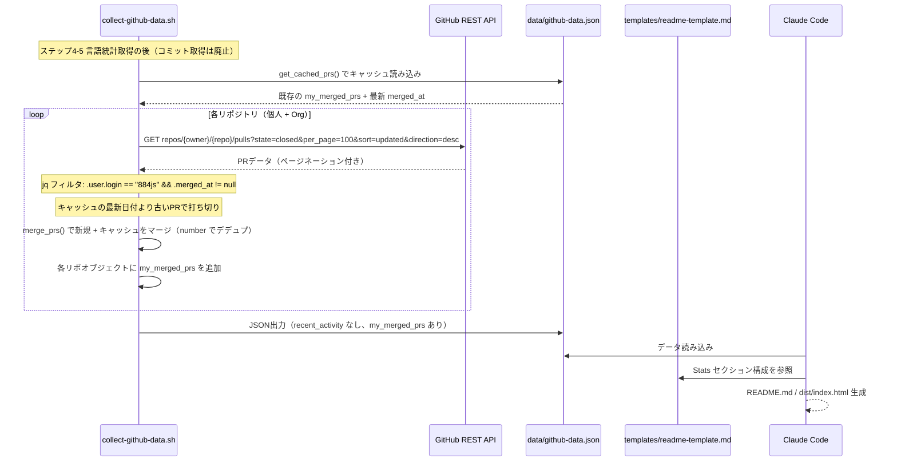
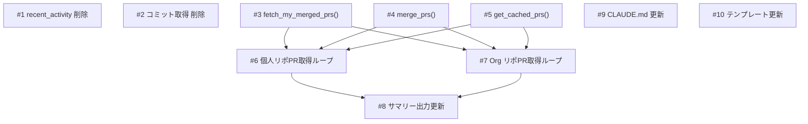

# コミット廃止・マージ済みPR取得への切り替え

## 1. 概要

`scripts/collect-github-data.sh` を改修し、以下の3点を実施する:
1. **最近のアクティビティ（recent_activity）の削除** — 活用されていないデータの収集を廃止
2. **コミット取得（my_commits）の完全廃止** — コミットメッセージの情報量が薄く、PRで代替可能
3. **マージ済みPR一覧の取得を追加** — PRタイトル・description の方が「何をやったか」の把握に優れている

取得したPRデータは各リポジトリオブジェクトの `my_merged_prs` フィールドに格納し、README およびポートフォリオサイトの Stats セクションに反映する。

## 2. 受入条件

| # | 条件 | 検証方法 |
|---|------|----------|
| AC-1 | `collect-github-data.sh` から recent_activity 関連のコード（ステップ7/7、一時ファイル書き出し、slurpfile参照、JSON出力フィールド）がすべて削除されている | スクリプトの grep 確認 |
| AC-2 | `collect-github-data.sh` からコミット取得関連のコード（`fetch_my_commits`, `merge_commits`, `get_cached_commits`, ステップ6/7のコミット取得ループ）がすべて削除されている | スクリプトの grep 確認 |
| AC-3 | `github-data.json` から `recent_activity` キーと各リポの `my_commits` フィールドが消えている | `jq 'has("recent_activity")'` が false、`jq '.personal_repos[0] \| has("my_commits")'` が false |
| AC-4 | 個人リポジトリ・Orgリポジトリそれぞれのマージ済みPR一覧が取得され、各リポジトリオブジェクトに `my_merged_prs` フィールドとして格納される | `jq '.personal_repos[0].my_merged_prs'` で確認 |
| AC-5 | PR取得にページネーション対応がある（100件/ページ） | 100件超のリポで確認 |
| AC-6 | PR取得に差分更新対応がある（既存キャッシュの最新 `merged_at` を基準に使用） | 2回実行して API コール数が減ることを確認 |
| AC-7 | 取得するPRフィールド: `number`, `title`, `body`, `merged_at`, `labels`, `additions`, `deletions`, `changed_files` | `jq '.personal_repos[0].my_merged_prs[0] \| keys'` で確認 |
| AC-8 | `templates/readme-template.md` の Stats セクションで、総コミット数がマージ済みPR数に置き換えられている | テンプレートファイル目視確認 |
| AC-9 | `CLAUDE.md` にPRデータの活用方法とプライバシールールが追記されている | ファイル目視確認 |
| AC-10 | PRタイトル・body はOrgリポの場合プライバシーリスクがあるため、`CLAUDE.md` に「PRタイトル/bodyは一般化して公開する or 非表示にする」ルールが追記されている | ファイル目視確認 |

## 3. スコープ

### やること

- `scripts/collect-github-data.sh` の改修（recent_activity 削除、コミット取得廃止、PR取得機能追加）
- `CLAUDE.md` の更新（PRデータ活用方法・プライバシールール追記）
- `templates/readme-template.md` の更新（Stats セクションにPR数追加）

### やらないこと

- `dist/index.html` の実際の生成（Claude Code が動的に行うため）
- GitHub Actions ワークフローの変更（現状のまま動作する）
- PR の内容分析やカテゴリ分類（将来拡張として検討）

## 4. データフロー



## 5. バックエンド変更

本プロジェクトにバックエンドサーバーは存在しない。データ収集は Bash スクリプトで行う。

### 5.1 API 呼び出し

| API エンドポイント | メソッド | 用途 | パラメータ |
|-------------------|---------|------|-----------|
| `repos/{owner}/{repo}/pulls` | GET | マージ済みPR一覧取得 | `state=closed`, `per_page=100`, `sort=updated`, `direction=desc` |

**レスポンスから抽出するフィールド:**

| フィールド | 型 | 説明 |
|-----------|-----|------|
| `number` | number | PR番号 |
| `title` | string | PRタイトル |
| `body` | string | PR本文（description） |
| `merged_at` | string (ISO 8601) | マージ日時（null の場合はクローズのみで除外） |
| `labels` | array of string | ラベル名一覧 |
| `additions` | number | 追加行数 |
| `deletions` | number | 削除行数 |
| `changed_files` | number | 変更ファイル数 |

**注意:** GitHub REST API の `/repos/{owner}/{repo}/pulls` は `author` クエリパラメータをサポートしていない。全 closed PR を取得し、jq で `.user.login == "884js"` かつ `.merged_at != null` でフィルタする。

### 5.2 追加するヘルパー関数

| 関数名 | 引数 | 戻り値 | 説明 |
|--------|------|--------|------|
| `fetch_my_merged_prs` | `owner`, `repo`, `since_date`(optional) | JSON配列 | ページネーション付きでマージ済みPRを取得。`since_date` より古い更新日のPRが出現したら取得を打ち切る |
| `merge_prs` | `new_prs`, `cached_prs` | JSON配列 | 新規PRとキャッシュをマージ。`number` で重複排除し、`merged_at` 降順でソート |
| `get_cached_prs` | `repo_name`, `section` | JSON配列 | キャッシュから指定リポの `my_merged_prs` を取得 |

### 5.3 差分更新の仕組み

`pulls` API は `since` パラメータをサポートしないため、コミット取得とは異なる差分更新戦略を採用する:

1. `sort=updated&direction=desc` で更新日降順に取得
2. キャッシュの最新 `merged_at` を基準日付として保持
3. 取得したPRの `updated_at` が基準日付より古い場合、ページネーションを打ち切る
4. `merge_prs()` で新規とキャッシュを `number` ベースでデデュプ・マージ

## 6. DB 変更

本プロジェクトにデータベースは存在しない。`data/github-data.json` がデータストアとして機能する。

### 6.1 JSON 構造の変更

**削除されるフィールド:**

| パス | 型 | 説明 |
|-----|-----|------|
| `$.recent_activity` | array | 最近のアクティビティ一覧（トップレベルから削除） |
| `$.personal_repos[].my_commits` | array | 個人リポジトリのコミット一覧（廃止） |
| `$.org_repos[].my_commits` | array | Orgリポジトリのコミット一覧（廃止） |

**追加されるフィールド:**

| パス | 型 | 説明 |
|-----|-----|------|
| `$.personal_repos[].my_merged_prs` | array | 個人リポジトリのマージ済みPR一覧 |
| `$.org_repos[].my_merged_prs` | array | Orgリポジトリのマージ済みPR一覧 |

**`my_merged_prs` の各要素の構造:**

| フィールド | 型 | 説明 |
|-----------|-----|------|
| `number` | number | PR番号 |
| `title` | string | PRタイトル |
| `body` | string | PR本文（description） |
| `merged_at` | string | マージ日時 (ISO 8601) |
| `labels` | array of string | ラベル名一覧 |
| `additions` | number | 追加行数 |
| `deletions` | number | 削除行数 |
| `changed_files` | number | 変更ファイル数 |

## 7. フロントエンド変更

### 7.1 templates/readme-template.md

**変更箇所: Stats セクション**

Stats セクションの項目一覧を以下に変更:

| 項目 | データソース | 説明 |
|------|-------------|------|
| マージ済みPR数 | `personal_repos[].my_merged_prs` + `org_repos[].my_merged_prs` の合算 | 全リポジトリのマージ済みPR総数（**総コミット数を置き換え**） |

既存項目のうち「総コミット数」をマージ済みPR数に置き換える。リポジトリ数、GitHub活動年数はそのまま維持する。

### 7.2 templates/site/template.html

変更なし。Claude Code が `data/github-data.json` を読み込んで動的に `dist/index.html` を生成する際、`my_merged_prs` データを活用する。テンプレート自体の変更は不要。

### 7.3 ワイヤーフレーム（Stats セクション）

```
+--------------------------------------------------+
|  ## Stats                                        |
|                                                  |
|  +----------+  +----------+  +----------+        |
|  | PRs      |  | Repos    |  | Years    |        |
|  |   567    |  |   42     |  |   5+     |        |
|  +----------+  +----------+  +----------+        |
+--------------------------------------------------+
```

## 8. CLAUDE.md 変更

### 8.1 追記内容

以下のセクションを `CLAUDE.md` に追記する:

**PRデータの活用方法:**
- `my_merged_prs` からマージ済みPR総数を算出し Stats に表示
- PR の `additions` / `deletions` / `changed_files` からコード貢献の規模感を算出可能

**PRデータのプライバシールール:**
- 個人リポジトリのPRタイトル・body はそのまま表示可能
- Org リポジトリのPRタイトル・body は一般化して表示するか非表示にする
- PR番号・マージ日時は統計情報として利用可能（リポジトリ名が紐づかない形であれば公開可）
- `additions` / `deletions` / `changed_files` は集計値として公開可能

## 9. テスト方針

| # | 対応AC | テスト内容 | 検証コマンド / 手順 |
|---|--------|-----------|-------------------|
| T-1 | AC-1 | recent_activity の完全削除 | `grep -c 'recent_activity' scripts/collect-github-data.sh` が 0 |
| T-2 | AC-2 | コミット取得の完全削除 | `grep -c 'my_commits\|fetch_my_commits\|merge_commits\|get_cached_commits' scripts/collect-github-data.sh` が 0 |
| T-3 | AC-3 | JSON から不要フィールドが消えている | `jq 'has("recent_activity")' data/github-data.json` が false、`jq '.personal_repos[0] \| has("my_commits")'` が false |
| T-4 | AC-4 | my_merged_prs フィールドの存在確認 | `jq '.personal_repos[0].my_merged_prs \| length' data/github-data.json` が 0 以上の整数 |
| T-5 | AC-7 | PRフィールドの網羅性確認 | `jq '.personal_repos[0].my_merged_prs[0] \| keys'` に number, title, body, merged_at, labels, additions, deletions, changed_files が含まれる |
| T-6 | AC-5 | ページネーション動作確認 | PR数が100件超のリポジトリでPR総数が正しいことを確認 |
| T-7 | AC-6 | 差分更新の動作確認 | スクリプトを2回実行し、2回目の API コール数が削減されていることを確認 |
| T-8 | AC-8 | テンプレートの更新確認 | `templates/readme-template.md` で総コミット数がマージ済みPR数に置き換わっていることを目視確認 |
| T-9 | AC-9, AC-10 | CLAUDE.md の更新確認 | PRデータ活用方法とプライバシールール（Org PR タイトル/body の扱い）が記載されていることを目視確認 |
| T-10 | - | スクリプト全体の正常終了 | `bash scripts/collect-github-data.sh` がエラーなく完了し、`data/github-data.json` が正しい JSON であること（`jq . data/github-data.json > /dev/null`） |

## 10. 実装タスク

| # | タスク | 対象ファイル | 見積 | 依存 |
|---|--------|-------------|------|------|
| 1 | recent_activity 関連コードの削除（ステップ7/7、一時ファイル書き出し、slurpfile参照、JSON出力フィールド） | `scripts/collect-github-data.sh` | S | - |
| 2 | コミット取得関連コードの削除（`fetch_my_commits`, `merge_commits`, `get_cached_commits`, ステップ6のコミット取得ループ、サマリーのコミット数表示） | `scripts/collect-github-data.sh` | S | - |
| 3 | `fetch_my_merged_prs()` ヘルパー関数の追加（ページネーション対応、author/merged_at フィルタ、差分更新打ち切り、body 含む） | `scripts/collect-github-data.sh` | M | - |
| 4 | `merge_prs()` ヘルパー関数の追加（キャッシュとのマージ、number でデデュプ、merged_at 降順ソート） | `scripts/collect-github-data.sh` | S | - |
| 5 | `get_cached_prs()` ヘルパー関数の追加（キャッシュから指定リポの my_merged_prs を取得） | `scripts/collect-github-data.sh` | S | - |
| 6 | 個人リポジトリのPR取得ループ追加（言語統計の後に配置） | `scripts/collect-github-data.sh` | M | 3, 4, 5 |
| 7 | Org リポジトリのPR取得ループ追加 | `scripts/collect-github-data.sh` | M | 3, 4, 5 |
| 8 | サマリー出力にマージ済みPR数を追加（コミット数表示は削除済み） | `scripts/collect-github-data.sh` | S | 6, 7 |
| 9 | PRデータの活用方法・プライバシールール追記 | `CLAUDE.md` | S | - |
| 10 | Stats セクションの総コミット数をマージ済みPR数に置き換え | `templates/readme-template.md` | S | - |


