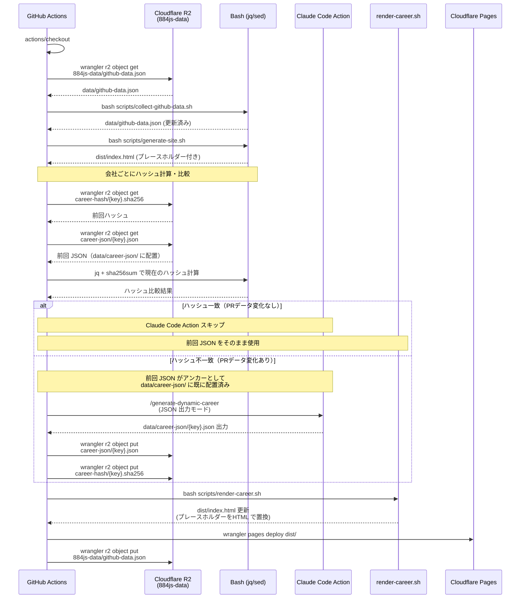
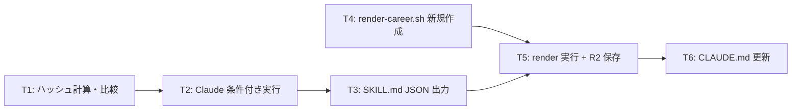

# 動的キャリア生成のインクリメンタル更新

## 概要

動的キャリアセクション生成（`/generate-dynamic-career`）の出力を HTML 直接生成から JSON 出力方式に変更し、ハッシュベースのインクリメンタル更新を導入する。Claude の出力を構造化データ（JSON）に限定することで HTML フォーマットブレを完全に排除し、JSON から HTML への変換は決定的な Bash スクリプト（`scripts/render-career.sh`）で行う。

### 背景・課題

- 現在は毎週 Claude Code Action を実行しているが、PR データに変化がない週でも毎回ゼロから生成している（コスト非効率）
- LLM の非決定性により、同じ入力データでも HTML 生成結果にブレが生じる
- Claude が HTML を直接出力するため、CSS クラスの不一致やマークアップの揺れが発生しやすい
- 前回の生成結果はどこにも保存されておらず、ワークフロー終了時に揮発する

### 目的

- PR データに変化がない週の Claude 呼び出しを完全にスキップし、API コストを削減する
- Claude の出力を JSON に限定し、HTML フォーマットブレを完全に排除する
- JSON → HTML 変換を決定的なスクリプトで行い、スタイル変更時の修正箇所を `render-career.sh` に一元化する
- PR データに変化がある場合も前回 JSON をアンカーとして渡すことで、出力の一貫性を保つ

### 設計判断

| 観点 | 判断 | 理由 |
|------|------|------|
| Claude の出力形式 | JSON（`data/career-json/{key}.json`） | 構造化データに限定することで HTML ブレを排除。差分比較も容易 |
| HTML 変換方式 | `scripts/render-career.sh`（jq + テンプレート） | 決定的に実行。スタイル変更時もこのスクリプトだけ修正すればよい |
| R2 保存パス（JSON） | `884js-data/career-json/{key}.json` | 会社ごとに JSON ファイルを個別管理 |
| R2 保存パス（ハッシュ） | `884js-data/career-hash/{key}.sha256` | ハッシュを個別ファイルで管理し比較を簡素化 |
| 会社キー | `medii`, `andd` | 日本語を避けて英語化。ワークフロー内でマッピング |
| ハッシュ計算対象 | `my_merged_prs` 配列 | `jq` で対象 Org の PR データを抽出し `sha256sum` で計算 |
| アンカー方式 | `data/career-json/{key}.json` に前回 JSON を配置 | SKILL.md で「このファイルがあれば差分更新モードで動作」と指示 |
| SKILL.md の allowedTools | `Read,Write,Glob,Grep` | JSON ファイルの Write が必要。HTML の Edit は不要になる |

### JSON フォーマット

会社ごとに 1 ファイル（`data/career-json/{key}.json`）:

```json
{
  "company_key": "medii",
  "projects": [
    {
      "name": "プロジェクト名（一般化済み）",
      "period": "2025-03 ~ 2025-06",
      "tech": ["TypeScript", "React", "Next.js"],
      "summary": "概要テキスト",
      "achievements": [
        "成果1",
        "成果2"
      ]
    }
  ]
}
```

## スコープ

### やること

- `update-deploy-profile.yml` にハッシュ計算・比較ステップを追加
- ハッシュ一致時のスキップ処理（R2 から前回 JSON 取得 → `render-career.sh` で HTML 変換・プレースホルダー置換）
- ハッシュ不一致時の条件付き Claude 実行 + 前回 JSON のアンカー配置
- Claude の出力を JSON ファイル（`data/career-json/{key}.json`）に変更（HTML は生成しない）
- `scripts/render-career.sh` を新規作成（JSON → HTML 変換 + プレースホルダー置換）
- SKILL.md の出力形式を JSON に変更し、allowedTools を `Read,Write,Glob,Grep` に更新
- CLAUDE.md に差分更新フローの説明を追記

### やらないこと

- `generate-site.sh` の変更（プレースホルダー方式は変わらないため不要）
- `career.yml` の変更（不要）
- `collect-github-data.sh` の変更（不要）

## 受入条件

| # | 受入条件 | 検証方法 |
|---|---------|---------|
| AC-1 | 各会社の PR データの SHA-256 ハッシュがワークフロー内で計算される | ワークフロー YAML の差分確認 |
| AC-2 | ハッシュが R2 に保存され、次回実行時に比較される | 手動実行後に R2 バケット内容を確認 |
| AC-3 | ハッシュ一致時は Claude Code Action がスキップされる | PRデータ変化なしで2回目実行し、Claude ステップが skip されることを確認 |
| AC-4 | スキップ時に前回 JSON が R2 から取得され、`render-career.sh` で HTML に変換されて `dist/index.html` に挿入される | 2回目実行後の `dist/index.html` に正しい HTML が含まれることを確認 |
| AC-5 | ハッシュ不一致時（PRデータ変化あり）は Claude Code Action が実行される | データ変化ありの状態で実行し、Claude ステップが実行されることを確認 |
| AC-6 | Claude 実行時、前回 JSON が `data/career-json/` に配置され、SKILL.md の指示でアンカーとして参照される | ワークフロー YAML + SKILL.md の差分確認 |
| AC-7 | Claude は HTML ではなく JSON ファイル（`data/career-json/{key}.json`）を出力する | Claude 実行後に `data/career-json/` に JSON ファイルが存在し、所定のフォーマットに従っていることを確認 |
| AC-8 | `scripts/render-career.sh` が JSON を HTML に変換し、`dist/index.html` のプレースホルダーを置換する | スクリプト実行後の `dist/index.html` に正しい HTML が含まれることを確認 |
| AC-9 | Claude 生成後、JSON とハッシュが R2 に保存される | 実行後に R2 バケットで `career-json/medii.json`, `career-hash/medii.sha256` を確認 |
| AC-10 | SKILL.md の出力が JSON に変更され、allowedTools が `Read,Write,Glob,Grep` に更新されている | SKILL.md の差分確認 |

## データフロー



## 影響範囲

### 変更対象ファイル

| ファイル | 変更種別 | 変更内容 |
|---------|---------|---------|
| `.github/workflows/update-deploy-profile.yml` | 修正 | ハッシュ計算・比較、条件分岐、R2 保存ステップ追加。Claude の allowedTools を `Read,Write,Glob,Grep` に変更。Claude Action 後に `render-career.sh` 実行ステップ追加 |
| `.claude/skills/generate-dynamic-career/SKILL.md` | 修正 | 出力を JSON に変更。差分更新モードの指示追加。allowedTools を `Read,Write,Glob,Grep` に更新 |
| `scripts/render-career.sh` | 新規 | JSON → HTML 変換スクリプト。`data/career-json/{key}.json` を読み込み、HTML を生成して `dist/index.html` のプレースホルダーを置換 |
| `CLAUDE.md` | 修正 | 差分更新フローの説明追記 |

### 変更なし

- `scripts/collect-github-data.sh`（ローカルパスは同じため不要）
- `scripts/generate-site.sh`（プレースホルダー方式は変わらないため不要）
- `career.yml`（変更不要）

### ワークフロー変更詳細

#### 追加するステップ

**ハッシュ計算・比較ステップ**
- R2 から前回ハッシュを取得（`884js-data/career-hash/medii.sha256`, `884js-data/career-hash/andd.sha256`）
- R2 から前回 JSON を取得（`884js-data/career-json/medii.json`, `884js-data/career-json/andd.json`）し `data/career-json/` に配置
- `data/github-data.json` から対象 Org の `my_merged_prs` 配列を `jq` で抽出し `sha256sum` で現在のハッシュを計算
- 前回ハッシュと比較し、結果を `GITHUB_OUTPUT` に設定（`medii_changed=true/false`, `andd_changed=true/false`）
- `continue-on-error: true`（初回は前回ハッシュなし）

**Claude Code Action の条件付き実行**
- `if` 条件: いずれかの会社でハッシュ不一致（`medii_changed=true` or `andd_changed=true`）
- `claude_args` の `allowedTools` を `Read,Write,Glob,Grep` に変更
- 前回 JSON が `data/career-json/` に既に配置済み（ハッシュ計算ステップで取得済み）のため、追加の R2 取得は不要

**render-career.sh 実行ステップ**
- Claude Action の後（スキップ時も実行）
- `bash scripts/render-career.sh` を実行し、`data/career-json/` の JSON を HTML に変換して `dist/index.html` のプレースホルダーを置換

**JSON + ハッシュの R2 保存ステップ**
- ハッシュ不一致で Claude が実行された場合に実行
- 生成された JSON と計算済みハッシュを R2 に保存
- 保存先: `884js-data/career-json/medii.json`, `884js-data/career-json/andd.json`, `884js-data/career-hash/medii.sha256`, `884js-data/career-hash/andd.sha256`

### R2 保存パス一覧

| パス | 内容 |
|------|------|
| `884js-data/career-json/medii.json` | 株式会社Medii の生成済みキャリア JSON |
| `884js-data/career-json/andd.json` | 株式会社and.d の生成済みキャリア JSON |
| `884js-data/career-hash/medii.sha256` | 株式会社Medii の PR データハッシュ |
| `884js-data/career-hash/andd.sha256` | 株式会社and.d の PR データハッシュ |
| `884js-data/github-data.json` | GitHub データ（既存） |

### SKILL.md 変更詳細

- 出力形式を `dist/index.html` の Edit から `data/career-json/{key}.json` の Write に変更
- allowedTools を `Read,Write,Glob,Grep` に更新（Edit は不要に）
- 「差分更新モード」セクションを追加
- `data/career-json/{key}.json` が存在する場合のフローを記述:
  - 前回 JSON の構造・内容をベースとして維持する
  - 新しい PR データの差分のみを反映する（プロジェクトの追加、成果の更新）
  - 既存のプロジェクト構造・文体を変更しない
- 前回 JSON がない場合は従来通りゼロから生成する
- JSON フォーマット仕様を明記する

### render-career.sh 詳細

- `data/career-json/` 配下の全 JSON ファイルを読み込み
- `jq` で JSON をパースし、HTML フラグメントを生成
- `career.yml` の会社情報（name, period, role, business）と組み合わせて完全な HTML ブロックを構築
- `dist/index.html` の `<!-- DYNAMIC_CAREER:会社名 -->` プレースホルダーを生成した HTML で置換
- HTML テンプレートは `templates/examples/career-example.html` の CSS クラス・構成に準拠

### CLAUDE.md 変更詳細

- 「ワークフロー」セクション内にインクリメンタル更新の説明を追記
- JSON 出力方式とハッシュスキップの概要を記述

## テスト方針

| # | テスト項目 | 対応AC | 方法 |
|---|----------|--------|------|
| 1 | 初回実行（R2 に前回データなし）で Claude が実行され、JSON/ハッシュが R2 に保存される | AC-1, AC-2, AC-5, AC-7, AC-9 | `workflow_dispatch` で手動実行。R2 バケットに `career-json/medii.json`, `career-hash/medii.sha256` 等が保存されていることを確認 |
| 2 | 2回目実行（PR データ変化なし）で Claude がスキップされ、前回 JSON から HTML が生成される | AC-3, AC-4, AC-8 | 続けて `workflow_dispatch` を実行。Claude ステップが skip になること、`render-career.sh` が実行されて `dist/index.html` に正しい HTML が含まれることを確認 |
| 3 | PR データに変化がある場合、Claude が差分更新モードで JSON を出力する | AC-5, AC-6, AC-7 | PR がマージされた後に実行し、Claude ステップが実行されること、`data/career-json/` に JSON が出力されていることをログで確認 |
| 4 | `render-career.sh` が JSON を正しい HTML に変換する | AC-8 | ローカルでスクリプトを実行し、出力 HTML が `career-example.html` の CSS クラス・構成に準拠していることを確認 |
| 5 | SKILL.md の出力が JSON に変更され、allowedTools が更新されている | AC-10 | ファイル差分の目視確認 |
| 6 | ハッシュ計算が会社ごとに正しく行われる | AC-1 | ステップログで medii/andd それぞれのハッシュ値が出力されていることを確認 |

## 実装タスク

| # | タスク | 対象ファイル | 見積 |
|---|--------|------------|------|
| T1 | ワークフローにハッシュ計算・比較ステップを追加（R2 から前回ハッシュ・JSON 取得、jq + sha256sum でハッシュ計算、比較結果を output に設定） | `.github/workflows/update-deploy-profile.yml` | M |
| T2 | Claude Code Action に if 条件追加（ハッシュ不一致時のみ実行）+ allowedTools を Read,Write,Glob,Grep に変更 | `.github/workflows/update-deploy-profile.yml` | S |
| T3 | SKILL.md の出力を JSON に変更（出力先を data/career-json/{key}.json に変更、JSON フォーマット仕様を明記、差分更新モード指示追加、allowedTools 更新） | `.claude/skills/generate-dynamic-career/SKILL.md` | M |
| T4 | render-career.sh を新規作成（data/career-json/ の JSON を読み込み、jq で HTML 生成、dist/index.html のプレースホルダーを置換） | `scripts/render-career.sh` | L |
| T5 | ワークフローに render-career.sh 実行ステップ追加 + JSON・ハッシュの R2 保存ステップ追加 | `.github/workflows/update-deploy-profile.yml` | M |
| T6 | CLAUDE.md の更新（JSON 出力方式と差分更新フローの説明追記） | `CLAUDE.md` | S |

### タスク依存関係



## 参考資料

- [docs/plans/incremental-career-generation/research.md](research.md) - 差分更新方式の調査結果
- [docs/plans/cloudflare-data-storage/plan.md](../cloudflare-data-storage/plan.md) - R2 基盤の設計
