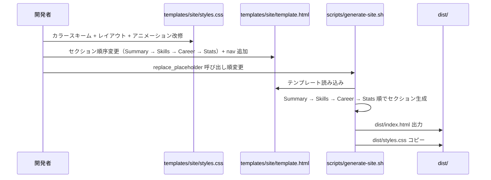
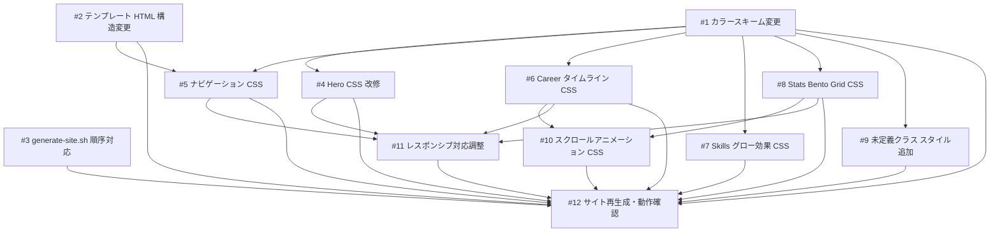

# 職務経歴書サイトのモダンデザイン刷新

## 1. 概要

職務経歴書サイトのデザインを Polished Minimal Dark ベースに刷新する。Bento Grid + Glassmorphism を部分導入し、セクション順序変更とナビゲーション追加を行う。

主な変更点:
1. **Hero セクション刷新** -- Mesh Gradient 背景 + グラデーションテキスト + clip-path
2. **ナビゲーション追加** -- sticky ヘッダーに各セクションへのジャンプリンク
3. **セクション順序変更** -- Summary → Skills → Career → Stats
4. **Career タイムライン化** -- 縦軸ライン + ドットマーカー（疑似要素）
5. **Glassmorphism カード** -- Career/Stats カードに backdrop-filter 適用
6. **Stats Bento Grid** -- 4カラムグリッド + span 2x2 カード
7. **カラースキーム変更** -- Tech & Futuristic 系（シアン/インディゴ）
8. **スクロールアニメーション** -- animation-timeline: view() + Firefox フォールバック

## 2. 受入条件

| # | 条件 | 検証方法 |
|---|------|----------|
| AC-1 | Hero セクションが Mesh Gradient 背景 + グラデーションテキスト + clip-path で刷新されている | ブラウザ目視確認 |
| AC-2 | ヘッダーにナビゲーション（Summary / Skills / Career / Stats へのジャンプリンク）が追加されている | ブラウザで各リンクのスクロール動作確認 |
| AC-3 | セクション順序が Summary → Skills → Career → Stats に変更されている | `dist/index.html` のセクション順序を目視確認 |
| AC-4 | Career セクションが縦軸タイムライン表現（::before/::after 疑似要素）になっている | ブラウザ目視確認 |
| AC-5 | Skills セクションにグロー効果ホバーが適用されている | ブラウザでホバー動作確認 |
| AC-6 | Stats セクションが Bento Grid レイアウトになっている | ブラウザ目視確認 |
| AC-7 | カラースキームが Tech & Futuristic 系（ネオンシアン/インディゴ系アクセント）に変更されている | ブラウザ目視確認 |
| AC-8 | ダーク/ライトモード両方が正常に動作する | OS 設定切り替えで確認 |
| AC-9 | レスポンシブ対応が維持されている（640px ブレークポイント） | DevTools で 640px 幅にして確認 |
| AC-10 | CSS 未定義だった生成クラス（.career-project, .project-*, .summary-text, .strengths 等）にスタイルが定義されている | ブラウザ目視確認 + CSS ファイル grep |
| AC-11 | スクロールフェードインアニメーションが Chrome/Edge で動作し、Firefox ではフォールバック（静的表示）される | Chrome と Firefox で表示比較 |
| AC-12 | Glassmorphism がカード背景に適用されている（Career/Stats カード） | ブラウザ目視確認（半透明 + ブラー効果） |

## 3. スコープ

### やること

- `templates/site/styles.css` の全面改修（カラースキーム、レイアウト、アニメーション）
- `templates/site/template.html` の構造変更（セクション順序変更 + ナビゲーション追加）
- `scripts/generate-site.sh` のセクション順序対応
- ダーク/ライトの新カラーパレット定義

### やらないこと

- `career.yml` の変更
- データ収集スクリプト（`scripts/collect-github-data.sh`）の変更
- GitHub Actions ワークフローの変更
- フォント変更（Inter + JetBrains Mono を維持）

## 4. データフロー



## 5. バックエンド変更

本プロジェクトにバックエンドサーバーは存在しない。

### 5.1 generate-site.sh の変更

| 変更箇所 | 変更内容 |
|----------|----------|
| `replace_placeholder` の呼び出し順 | 既存の順序を Summary → Skills → Career → Stats に変更 |

**注意:** `replace_placeholder` は awk ベースのテキスト置換であり、呼び出し順序はセクション順序に直接影響しない（プレースホルダー名で一意にマッチする）。ただし、template.html 内のセクション順序自体が変更されるため、可読性のためにスクリプト側の呼び出し順も合わせる。

## 6. DB 変更

本プロジェクトにデータベースは存在しない。データ構造の変更もない。

## 7. フロントエンド変更

### 7.1 templates/site/template.html

**変更内容:**

| 変更箇所 | 変更前 | 変更後 |
|----------|--------|--------|
| header 内 | social-links の後にコンテンツなし | `<nav>` 要素を追加（Summary / Skills / Career / Stats へのアンカーリンク） |
| main 内セクション順序 | 既存の順序 | Summary → Skills → Career → Stats |

**nav 要素の構成:**

| 要素 | リンク先 | テキスト |
|------|---------|---------|
| `<a>` | `#summary` | Summary |
| `<a>` | `#skills` | Skills |
| `<a>` | `#career` | Career |
| `<a>` | `#stats` | Stats |

### 7.2 templates/site/styles.css

#### カラースキーム（:root カスタムプロパティ）

**ダークモード（デフォルト）:**

| プロパティ | 現在値 | 新値 | 説明 |
|-----------|-------|------|------|
| `--bg-primary` | `#0d1117` | `#0F172A` | 背景: Slate 900 |
| `--bg-secondary` | `#161b22` | `#1E293B` | カード背景: Slate 800 |
| `--bg-tertiary` | `#21262d` | `#334155` | タグ背景: Slate 700 |
| `--text-primary` | `#e6edf3` | `#F1F5F9` | テキスト: Slate 100 |
| `--text-secondary` | `#8b949e` | `#94A3B8` | サブテキスト: Slate 400 |
| `--text-link` | `#58a6ff` | `#22D3EE` | リンク: シアン |
| `--border-color` | `#30363d` | `#334155` | ボーダー: Slate 700 |
| `--accent` | `#58a6ff` | `#22D3EE` | アクセント: ネオンシアン |
| `--accent-emphasis` | `#1f6feb` | `#6366F1` | サブアクセント: インディゴ |
| `--success` | `#3fb950` | `#34D399` | 成功: エメラルド |
| `--warning` | `#d29922` | `#FBBF24` | 警告: アンバー |
| （新規）`--glass-bg` | - | `rgba(255, 255, 255, 0.05)` | Glassmorphism 背景 |
| （新規）`--glass-border` | - | `rgba(255, 255, 255, 0.1)` | Glassmorphism ボーダー |

**ライトモード（prefers-color-scheme: light）:**

| プロパティ | 現在値 | 新値 |
|-----------|-------|------|
| `--bg-primary` | `#ffffff` | `#F8FAFC` |
| `--bg-secondary` | `#f6f8fa` | `#F1F5F9` |
| `--bg-tertiary` | `#eaeef2` | `#E2E8F0` |
| `--text-primary` | `#1f2328` | `#0F172A` |
| `--text-secondary` | `#656d76` | `#475569` |
| `--text-link` | `#0969da` | `#0891B2` |
| `--border-color` | `#d0d7de` | `#CBD5E1` |
| `--accent` | `#0969da` | `#0891B2` |
| `--accent-emphasis` | `#0550ae` | `#4F46E5` |
| `--glass-bg` | - | `rgba(255, 255, 255, 0.6)` |
| `--glass-border` | - | `rgba(0, 0, 0, 0.08)` |

#### Hero セクション CSS

| プロパティ | 値 | 説明 |
|-----------|-----|------|
| `background` | radial-gradient 2-3 重 + var(--bg-primary) | Mesh Gradient 背景 |
| `clip-path` | `polygon(0 0, 100% 0, 100% 88%, 0 100%)` | 下端を斜めにカット |
| `padding` | `5rem 0 4rem` | 上下パディング拡大 |

**Hero h1（グラデーションテキスト）:**

| プロパティ | 値 |
|-----------|-----|
| `background` | `linear-gradient(135deg, var(--accent), var(--accent-emphasis))` |
| `-webkit-background-clip` | `text` |
| `-webkit-text-fill-color` | `transparent` |
| `background-clip` | `text` |
| `font-size` | `2.5rem` |

#### ナビゲーション CSS

| セレクタ | プロパティ | 値 | 説明 |
|---------|-----------|-----|------|
| `nav` | `position` | `sticky` | スクロール時に追従 |
| `nav` | `top` | `0` | 上端に固定 |
| `nav` | `z-index` | `100` | 他要素の上に表示 |
| `nav` | `background` | `var(--glass-bg)` | Glassmorphism 背景 |
| `nav` | `backdrop-filter` | `blur(12px)` | ブラー効果 |
| `nav a` | `color` | `var(--text-secondary)` | リンク色 |
| `nav a:hover` | `color` | `var(--accent)` | ホバー時アクセント色 |

#### Career タイムライン CSS

| セレクタ | プロパティ | 値 | 説明 |
|---------|-----------|-----|------|
| `.career-timeline` | `position` | `relative` | 疑似要素の基準 |
| `.career-timeline` | `padding-left` | `2rem` | タイムライン用スペース |
| `.career-timeline::before` | `content` | `""` | 縦ライン |
| `.career-timeline::before` | `width` | `2px` | ライン幅 |
| `.career-timeline::before` | `background` | `var(--accent)` | ライン色 |
| `.career-item::after` | `content` | `""` | ドットマーカー |
| `.career-item::after` | `width / height` | `12px` | ドットサイズ |
| `.career-item::after` | `border-radius` | `50%` | 円形 |
| `.career-item::after` | `background` | `var(--accent)` | ドット色 |
| `.career-item` | `background` | `var(--glass-bg)` | Glassmorphism 背景 |
| `.career-item` | `backdrop-filter` | `blur(12px)` | ブラー効果 |
| `.career-item` | `border` | `1px solid var(--glass-border)` | Glassmorphism ボーダー |

#### Skills グロー効果 CSS

| セレクタ | プロパティ | 値 | 説明 |
|---------|-----------|-----|------|
| `.skill-tag` | `transition` | `all 0.3s ease` | アニメーション |
| `.skill-tag:hover` | `box-shadow` | `0 0 16px rgba(34, 211, 238, 0.5)` | グロー効果 |
| `.skill-tag:hover` | `border-color` | `var(--accent)` | ボーダー色変化 |

#### Stats Bento Grid CSS

| セレクタ | プロパティ | 値 | 説明 |
|---------|-----------|-----|------|
| `.stats-grid` | `display` | `grid` | グリッドレイアウト |
| `.stats-grid` | `grid-template-columns` | `repeat(4, 1fr)` | 4カラム |
| `.stat-card:nth-child(1)` | `grid-column` | `span 2` | 最初のカード 2x2 |
| `.stat-card:nth-child(1)` | `grid-row` | `span 2` | 最初のカード 2x2 |
| `.stat-card` | `background` | `var(--glass-bg)` | Glassmorphism 背景 |
| `.stat-card` | `backdrop-filter` | `blur(12px)` | ブラー効果 |
| `.stat-value` | `text-shadow` | `0 0 20px rgba(34, 211, 238, 0.5)` | グロー効果 |

#### 未定義クラスへのスタイル追加

| クラス名 | 出力元 | 主要プロパティ |
|---------|--------|--------------|
| `.career-project` | `generate-site.sh` の `generate_project()` | margin-top, padding-left, border-left |
| `.project-meta` | `generate-site.sh` の `generate_project()` | display: flex, gap, flex-wrap, color, font-size |
| `.project-period` | `generate-site.sh` の `generate_project()` | color: var(--text-secondary) |
| `.project-role` | `generate-site.sh` の `generate_project()` | color: var(--accent) |
| `.project-team` | `generate-site.sh` の `generate_project()` | color: var(--text-secondary) |
| `.project-tech` | `generate-site.sh` の `generate_project()` | display: flex, flex-wrap, gap |
| `.project-summary` | `generate-site.sh` の `generate_project()` | color: var(--text-secondary), margin-top |
| `.project-achievements` | `generate-site.sh` の `generate_project()` | list-style, padding-left, margin-top |
| `.summary-text` | `generate-site.sh` の `generate_summary()` | margin-bottom, line-height |
| `.strengths` | `generate-site.sh` の `generate_summary()` | display: grid, gap |
| `.strength-item` | `generate-site.sh` の `generate_summary()` | padding, background, border-radius |
| `.career-business` | `generate-site.sh` の `generate_career()` | color: var(--text-secondary), font-size, margin-bottom |

#### スクロールフェードインアニメーション CSS

| セレクタ / ルール | プロパティ | 値 | 説明 |
|---------|-----------|-----|------|
| `@keyframes fadeInUp` | `from` | `opacity: 0; transform: translateY(20px)` | 初期状態 |
| `@keyframes fadeInUp` | `to` | `opacity: 1; transform: translateY(0)` | 最終状態 |
| `@supports (animation-timeline: view())` 内 `.career-item, .stat-card` | `animation` | `fadeInUp linear` | アニメーション定義 |
| 同上 | `animation-timeline` | `view()` | スクロール連動 |
| 同上 | `animation-range` | `entry 0% entry 40%` | 表示範囲 |
| フォールバック（@supports 外） | - | アニメーションなし（静的表示） | Firefox 対応 |

#### レスポンシブ対応（640px）

| セレクタ | プロパティ | 値 | 説明 |
|---------|-----------|-----|------|
| `.stats-grid` | `grid-template-columns` | `repeat(2, 1fr)` | 2カラムに変更 |
| `.stat-card:nth-child(1)` | `grid-column / grid-row` | `auto` | span 解除 |
| `nav` | `flex-wrap` | `wrap` | ナビ折り返し |
| `.career-timeline` | `padding-left` | `1rem` | タイムラインスペース縮小 |
| `.hero` | `clip-path` | `none` | 斜めカット解除 |

### 7.3 ワイヤーフレーム

**デスクトップ（900px）:**

```
+--------------------------------------------------+
|                    HERO                           |
|  [Mesh Gradient Background]                       |
|                                                   |
|        (avatar)                                   |
|     ~~Gradient Text Name~~                        |
|        bio text here                              |
|        [GitHub]                                   |
|                                            /      |
|  clip-path: polygon (斜めカット)         /        |
+----------------------------------------------/----+
|  [Summary]  [Skills]  [Career]  [Stats]  <- nav   |
+--------------------------------------------------+
|                                                   |
|  ## Summary (概要)                                 |
|                                                   |
|  summary text ...                                 |
|                                                   |
|  得意領域:                                         |
|  +------------+  +------------+                   |
|  | Strength 1 |  | Strength 2 |                   |
|  +------------+  +------------+                   |
|                                                   |
+--------------------------------------------------+
|                                                   |
|  ## Skills (スキルセット)                          |
|                                                   |
|  Languages:                                       |
|  [TypeScript] [Go] [Python] [Rust]  <- glow hover |
|                                                   |
|  Frameworks:                                      |
|  [React] [Next.js] [NestJS]                       |
|                                                   |
+--------------------------------------------------+
|                                                   |
|  ## Career (職務経歴詳細)                          |
|                                                   |
|  |  o-- +---[Glass Card]-------------------+      |
|  |     | Company A  (2023-現在)             |      |
|  |     | Role: Senior Engineer              |      |
|  |     |   +--[project]--+                  |      |
|  |     |   | Project 1   |                  |      |
|  |     |   +-------------+                  |      |
|  |     +------------------------------------+      |
|  |                                                |
|  |  o-- +---[Glass Card]-------------------+      |
|  |     | Company B  (2020-2023)             |      |
|  |     +------------------------------------+      |
|                                                   |
+--------------------------------------------------+
|                                                   |
|  ## Stats                                         |
|                                                   |
|  +--Bento Grid (4col)-------------------+         |
|  | +--------+---------+ +---------+     |         |
|  | |  PRs   |         | | Repos   |     |         |
|  | |  567   | (2x2)   | |   42    |     |         |
|  | |        |         | +---------+     |         |
|  | |        |         | +---------+     |         |
|  | +--------+---------+ | Years   |     |         |
|  |                      |   5+    |     |         |
|  |                      +---------+     |         |
|  +--------------------------------------+         |
|                                                   |
+--------------------------------------------------+
|  footer: Last updated: 2026-03-07                 |
+--------------------------------------------------+
```

**モバイル（640px 以下）:**

```
+-------------------------+
|         HERO            |
| (clip-path: none)       |
|   (avatar 90px)         |
|   ~~Name~~              |
|   bio                   |
|   [GitHub]              |
+-------------------------+
| [Summary] [Skills]      |
| [Career]  [Stats]       |
+-------------------------+
| ## Summary              |
| text...                 |
| +----------+            |
| | Strength |            |
| +----------+            |
+-------------------------+
| ## Skills               |
| [TS] [Go] [Python]     |
+-------------------------+
|                         |
| ## Career               |
| | o-- [Glass Card]      |
| |    Company A          |
| |    ...                |
| | o-- [Glass Card]      |
| |    Company B          |
|                         |
+-------------------------+
| ## Stats (2col)         |
| +------+ +------+      |
| | PRs  | | Repo |      |
| +------+ +------+      |
| +------+ +------+      |
| | Code | | Year |      |
| +------+ +------+      |
+-------------------------+
| footer                  |
+-------------------------+
```

## 8. テスト方針

| # | 対応AC | テスト内容 | 検証手順 |
|---|--------|-----------|---------|
| T-1 | AC-3 | セクション順序の確認 | `bash scripts/generate-site.sh` 実行後、`dist/index.html` でセクション ID の出現順が summary → skills → career → stats であることを grep で確認 |
| T-2 | AC-1, AC-7, AC-12 | Hero + カラースキームの確認 | `dist/index.html` をブラウザで開き、Mesh Gradient 背景・グラデーションテキスト・clip-path・新カラーが適用されていることを目視確認 |
| T-3 | AC-2 | ナビゲーション動作確認 | 各ナビリンク（Summary / Skills / Career / Stats）をクリックして対応セクションにスクロールすることを確認 |
| T-4 | AC-4, AC-12 | Career タイムライン + Glassmorphism 確認 | ブラウザで縦ライン・ドットマーカー・半透明カード背景を目視確認 |
| T-5 | AC-5 | Skills グロー効果確認 | ブラウザで .skill-tag にホバーし、box-shadow グロー + border-color 変化を確認 |
| T-6 | AC-6, AC-12 | Stats Bento Grid 確認 | ブラウザで 4カラムグリッド・最初のカード span 2x2・Glassmorphism を目視確認 |
| T-7 | AC-8 | ダーク/ライトモード確認 | OS のカラースキーム設定を切り替えて両モードで正常表示されることを確認 |
| T-8 | AC-9 | レスポンシブ確認 | DevTools で 640px 幅にし、Stats が 2カラム化、nav が折り返し、clip-path が解除されることを確認 |
| T-9 | AC-10 | 未定義クラスのスタイル確認 | ブラウザで Career プロジェクト詳細・Summary テキスト・得意領域が正しくスタイリングされていることを確認。`grep -E 'career-project|project-meta|summary-text|strengths' dist/styles.css` でクラス定義の存在を確認 |
| T-10 | AC-11 | スクロールアニメーション確認 | Chrome でスクロール時に career-item/stat-card がフェードインすることを確認。Firefox で静的表示（アニメーションなし）になることを確認 |
| T-11 | - | 生成スクリプトの正常終了 | `bash scripts/generate-site.sh` がエラーなく完了し、`dist/index.html` と `dist/styles.css` が生成されること |

## 9. 実装タスク

| # | タスク | 対象ファイル | 見積 | 依存 |
|---|--------|-------------|------|------|
| 1 | カラースキーム変更（:root と light テーマのカスタムプロパティ更新、--glass-bg / --glass-border 追加） | `templates/site/styles.css` | S | - |
| 2 | テンプレート HTML 構造変更（セクション順序を Summary → Skills → Career → Stats に変更 + nav 要素追加） | `templates/site/template.html` | S | - |
| 3 | generate-site.sh のセクション順序対応（replace_placeholder の呼び出し順を Summary → Skills → Career → Stats に変更） | `scripts/generate-site.sh` | S | - |
| 4 | Hero セクション CSS 改修（Mesh Gradient 背景 + gradient text + clip-path） | `templates/site/styles.css` | M | 1 |
| 5 | ナビゲーション CSS（sticky nav + Glassmorphism 背景 + リンクスタイリング） | `templates/site/styles.css` | S | 1, 2 |
| 6 | Career タイムライン CSS（::before 縦ライン + ::after ドットマーカー + Glassmorphism カード） | `templates/site/styles.css` | M | 1 |
| 7 | Skills セクション CSS 改修（.skill-tag ホバー時グロー効果 + border-color 変化） | `templates/site/styles.css` | S | 1 |
| 8 | Stats Bento Grid CSS（4カラムグリッド + nth-child(1) span 2x2 + Glassmorphism + グロー数字） | `templates/site/styles.css` | M | 1 |
| 9 | CSS 未定義クラスへのスタイル追加（.career-project, .project-*, .summary-text, .strengths, .strength-item, .career-business） | `templates/site/styles.css` | M | 1 |
| 10 | スクロールフェードインアニメーション CSS（@keyframes fadeInUp + @supports (animation-timeline: view()) + フォールバック） | `templates/site/styles.css` | S | 6, 8 |
| 11 | レスポンシブ対応の調整（640px ブレークポイントで Stats 2col化、nav 折り返し、clip-path 解除、タイムライン縮小） | `templates/site/styles.css` | M | 4, 5, 6, 8 |
| 12 | サイト再生成（bash scripts/generate-site.sh）して dist/ の動作確認 | `dist/index.html`, `dist/styles.css` | S | 1-11 |



## 10. 参考資料

- `docs/plans/modern-site-design/research.md` -- デザインリサーチ結果（カラーパレット候補、CSS エフェクト、ブラウザ互換性）
