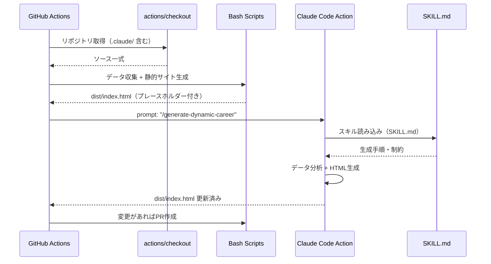
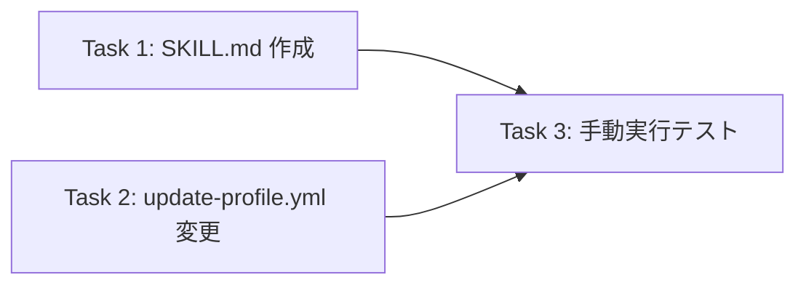

# update-profile プロンプトのスキル化

## 概要

update-profile.yml の Claude Code Action に記述されたインラインプロンプト（約65行）を、プロジェクトスキル（`.claude/skills/generate-dynamic-career/SKILL.md`）に切り出す。ワークフロー側は `/generate-dynamic-career` でスキルを呼び出すだけに簡素化し、`max-turns` を 30 から 50 に増加させる。

### 背景・課題

- 現在のインラインプロンプトは約65行あり、ワークフローファイルの見通しが悪い
- `max-turns: 30` に到達してエラー終了するケースが発生している
- プロンプトの改善・メンテナンスがワークフロー YAML 内で行いにくい

### 目的

- プロンプトをスキルファイルに分離し、ワークフローの簡素化とメンテナンス性向上を実現する
- `max-turns` を 50 に増加させ、ターン数不足によるエラーを解消する

## スコープ

### やること

- `.claude/skills/generate-dynamic-career/SKILL.md` の新規作成
- `.github/workflows/update-profile.yml` の Claude Code Action 設定変更（`prompt` 簡素化 + `max-turns` 増加）

### やらないこと

- CLAUDE.md の変更
- career.yml の変更
- generate-site.sh の変更
- データ前処理スクリプトの追加（将来の改善として検討）

## 受入条件

| # | 条件 | 確認方法 |
|---|------|---------|
| AC-1 | `.claude/skills/generate-dynamic-career/SKILL.md` が作成されている | ファイル存在確認 |
| AC-2 | SKILL.md のフロントマターに `name`, `description`, `allowed-tools` が正しく設定されている | YAML パース確認 |
| AC-3 | SKILL.md の本文に現在のプロンプト内容（5ステップの生成手順、プライバシー一般化の具体例、出力フォーマット参照、制約事項）が含まれている | 内容レビュー |
| AC-4 | `update-profile.yml` の `prompt` が `"/generate-dynamic-career"` に簡素化されている | ファイル差分確認 |
| AC-5 | `update-profile.yml` の `max-turns` が 50 に変更されている | ファイル差分確認 |
| AC-6 | `workflow_dispatch` で手動実行してエラーなく完了する | GitHub Actions 実行結果 |

## データフロー

## 影響範囲

### 変更ファイル一覧

| ファイル | 変更種別 | 変更内容 |
|---------|---------|---------|
| `.claude/skills/generate-dynamic-career/SKILL.md` | 新規作成 | スキル定義（フロントマター + プロンプト本文） |
| `.github/workflows/update-profile.yml` | 修正 | `prompt` フィールド簡素化、`claude_args` の `max-turns` 変更 |

### 変更なし

- バックエンド: 変更なし（GitHub Actions ワークフローの設定変更のみ）
- フロントエンド: 変更なし
- DB: 変更なし

## 詳細設計

### SKILL.md の構成

| 項目 | 内容 |
|------|------|
| 配置パス | `.claude/skills/generate-dynamic-career/SKILL.md` |
| `name` | `generate-dynamic-career` |
| `description` | `dist/index.html の DYNAMIC_CAREER プレースホルダーを GitHub データで分析・生成した職務経歴 HTML で置換する` |
| `allowed-tools` | `Read, Edit, Glob, Grep` |

### SKILL.md 本文の構成

| セクション | 内容 |
|-----------|------|
| 目的 | DYNAMIC_CAREER プレースホルダーの HTML 置換 |
| データ分析アプローチ | career.yml の単純転記ではなく GitHub データからの推定を指示 |
| 入力データ | dist/index.html, data/github-data.json, career.yml, templates/examples/career-example.html |
| Step 1 | Org 特定（career.yml と org_repos の照合） |
| Step 2 | リリースPR除外（タイトルによるフィルタリング） |
| Step 3 | 機能開発PRのカテゴリ分類 |
| Step 4 | カテゴリからプロジェクト構造化 |
| Step 5 | プライバシー一般化の適用（具体例付き） |
| 出力フォーマット | career-example.html を参考に構成・粒度を揃える指示 |
| 制約 | CLAUDE.md プライバシールール厳守、日本語生成、dist/index.html のみ変更 |

### update-profile.yml の変更箇所

| 項目 | 変更前 | 変更後 |
|------|--------|--------|
| `prompt` | インラインプロンプト（約65行） | `/generate-dynamic-career` |
| `claude_args` の `--max-turns` | `30` | `50` |

### allowedTools の2レイヤー構成

| レイヤー | 設定場所 | 許可ツール |
|---------|---------|-----------|
| スキル | SKILL.md `allowed-tools` | `Read, Edit, Glob, Grep` |
| アクション | `claude_args --allowedTools` | `Read, Edit, Glob, Grep` |

両レイヤーで同一のツールセットを許可し、permission denial を防止する。

## テスト方針

| # | テスト項目 | 対応AC | 確認方法 |
|---|-----------|-------|---------|
| T-1 | SKILL.md のフロントマターが有効な YAML である | AC-2 | 手動確認（YAML パーサーで検証） |
| T-2 | update-profile.yml が有効な YAML である | AC-4, AC-5 | 手動確認（YAML パーサーで検証） |
| T-3 | `workflow_dispatch` で実行し `error_max_turns` にならない | AC-6 | GitHub Actions 手動実行 |
| T-4 | `dist/index.html` の DYNAMIC_CAREER プレースホルダーが HTML で置換される | AC-3, AC-6 | 実行後の dist/index.html を確認 |

## 実装タスク

| # | タスク | 対象ファイル | 見積 |
|---|--------|------------|------|
| 1 | SKILL.md 作成（フロントマター + プロンプト本文の移植・最適化） | `.claude/skills/generate-dynamic-career/SKILL.md` | 30min |
| 2 | update-profile.yml の Claude Code Action 設定変更（prompt 簡素化 + max-turns 増加） | `.github/workflows/update-profile.yml` | 10min |
| 3 | workflow_dispatch で手動実行して動作確認 | - | 15min |

### タスク依存関係

## 参考資料

- `docs/plans/skill-based-profile-update/research.md` - スキル化リサーチ結果
- [Claude Code スキル公式ドキュメント](https://code.claude.com/docs/en/skills)
- [Claude Code GitHub Actions](https://code.claude.com/docs/en/github-actions)
